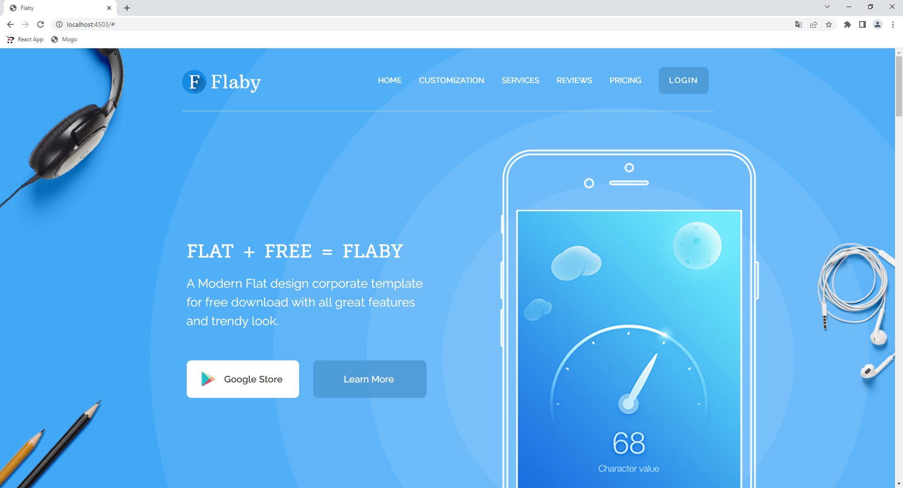

# Flaby
## :uk: English
__Description:__ Adaptive landing

__Deployed project:__ http://flaby.alexander-portfolio-and-cv.com

__Used technologies:__

- SCSS
- BEM
- Adaptive-responsive design

__About project:__ Flaby is light adaptive landing, that describes products advantages and provides form for subscription. Thanks to adaptive-responsive design website looks great on all screens and devices. SASS preprocessor and BEM methodology also were used in development.

## :ru: Русский
__Описание:__ Адаптивный лендинг

__Развернутый проект:__ http://flaby.alexander-portfolio-and-cv.com

__Использованные технологии:__

- SCSS
- БЭМ
- Адаптивно-отзывчивый дизайн

 

__О проекте:__ Flaby - это легкий адаптивный лединг, рассказывающий о преимуществах продукта и предоставляющий форму для подписки. Благодаря адаптивно-отзывчивой верстке, сайт хорошо выглядит на всех типах устройств. При разработке применялись препроцессор SASS и методология БЭМ.

 

## Preview/Превью

